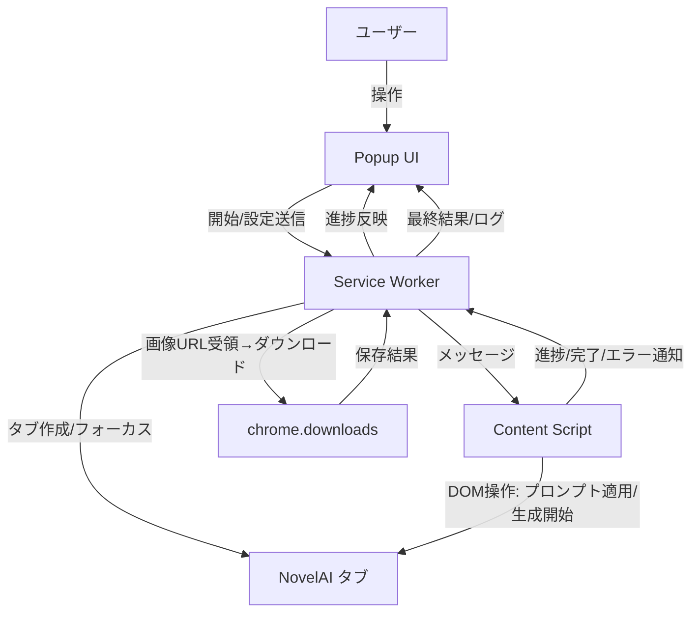
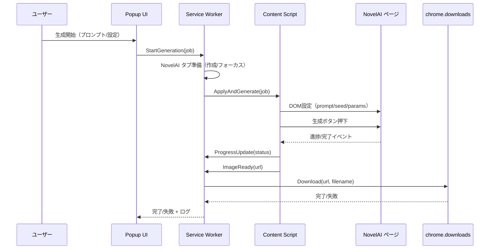
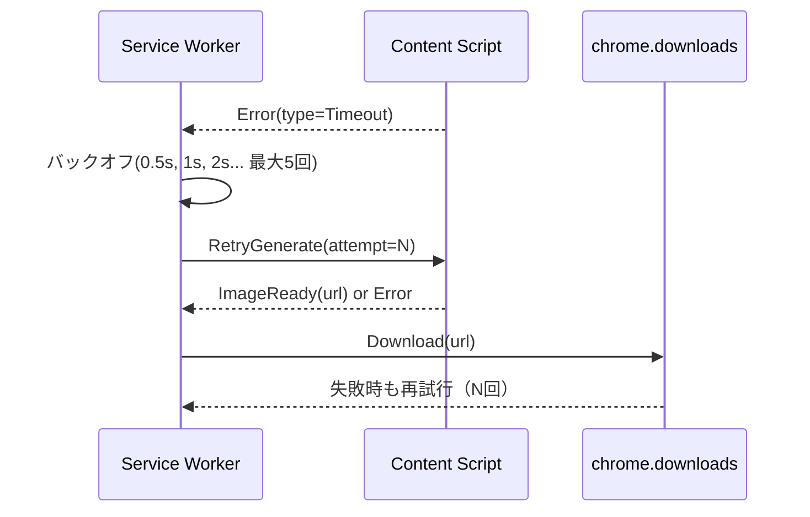

# データフロー図

## ユーザーインタラクションフロー

```mermaid
flowchart TD
    U[ユーザー] -->|操作| P[Popup UI]
    P -->|開始/設定送信| SW[Service Worker]
    SW -->|タブ作成/フォーカス| T[NovelAI タブ]
    SW -->|メッセージ| CS[Content Script]
    CS -->|DOM操作: プロンプト適用/生成開始| T
    CS -->|進捗/完了/エラー通知| SW
    SW -->|進捗反映| P
    SW -->|画像URL受領→ダウンロード| DL[chrome.downloads]
    DL -->|保存結果| SW
    SW -->|最終結果/ログ| P
```

## データ処理フロー（単枚生成）

```mermaid
sequenceDiagram
    participant U as ユーザー
    participant P as Popup UI
    participant SW as Service Worker
    participant CS as Content Script
    participant NA as NovelAI ページ
    participant D as chrome.downloads

    U->>P: 生成開始（プロンプト/設定）
    P->>SW: StartGeneration(job)
    SW->>SW: NovelAI タブ準備（作成/フォーカス）
    SW->>CS: ApplyAndGenerate(job)
    CS->>NA: DOM設定（prompt/seed/params）
    CS->>NA: 生成ボタン押下
    NA-->>CS: 進捗/完了イベント
    CS->>SW: ProgressUpdate(status)
    CS->>SW: ImageReady(url)
    SW->>D: Download(url, filename)
    D-->>SW: 完了/失敗
    SW-->>P: 完了/失敗 + ログ
```

## データ処理フロー（失敗時リトライ）

```mermaid
sequenceDiagram
    participant SW as Service Worker
    participant CS as Content Script
    participant D as chrome.downloads

    CS-->>SW: Error(type=Timeout)
    SW->>SW: バックオフ(0.5s, 1s, 2s... 最大5回)
    SW->>CS: RetryGenerate(attempt=N)
    CS-->>SW: ImageReady(url) or Error
    SW->>D: Download(url)
    D-->>SW: 失敗時も再試行（N回）
```

