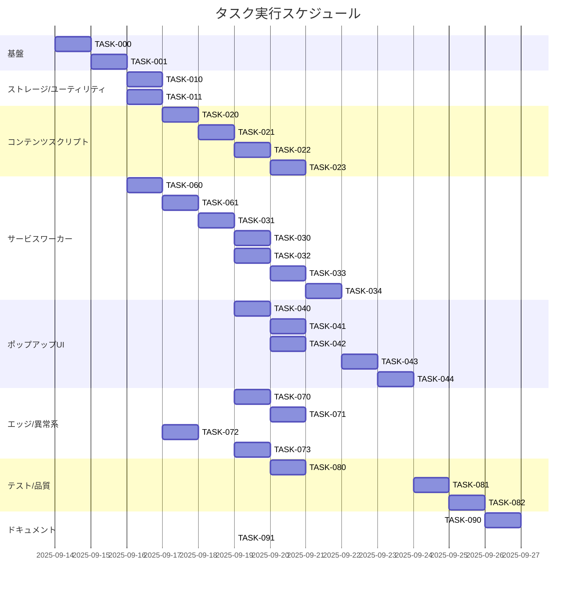

# NovelAI Auto Generator 実装タスク

## 概要

全タスク数: 26
推定作業時間: 8.5〜12.5 人日  
**進捗**: 1/26 完了 (TASK-000 ✅)
クリティカルパス: TASK-060 → TASK-061 → TASK-031 → TASK-030 → TASK-020 → TASK-021 → TASK-022 → TASK-033 → TASK-041 → TASK-043 → TASK-081

### プロジェクト状況 📊

- **完了**: TASK-000 (プロジェクト基盤) ✅ 2025-09-14
- **次のタスク**: TASK-001 (CI/品質ゲート) 📍
- **ブロッカー**: なし
- **技術スタック**: TypeScript + Vitest + Chrome Extension MV3

### 主要成果物 (TASK-000)

- ✅ Chrome Extension Manifest V3 対応
- ✅ TypeScript 厳密設定 + Vitest テスト環境
- ✅ Service Worker、Content Script、Popup UI の基盤
- ✅ Chrome API モック、型定義、ESLint/Prettier
- ✅ 7/7 テスト合格、ビルド成功

## タスク一覧

### フェーズ0: 基盤・環境

#### TASK-000: プロジェクト構成と基本ツール設定

- [x] **タスク完了** ✅ **2025-09-14 完了**
- **タスクタイプ**: DIRECT
- **要件リンク**: REQ-401, REQ-403, REQ-404
- **依存タスク**: なし
- **実装詳細**:
  - `manifest.json` Chrome Extension Manifest V3対応
  - TypeScript + Vitest環境構築
  - Service Worker (`background.ts`), Content Script (`content.ts`), Popup UI
  - 型定義とChrome APIモック環境
- **テスト要件**:
  - [x] ビルド/型チェックが成功する
  - [x] テスト実行とカバレッジ収集が可能
- **実装結果**:
  - [x] 拡張が unpacked で読み込める最小構成が完成
  - [x] TypeScript厳密設定でコンパイル成功
  - [x] Vitest 7/7 テスト合格
  - [x] ESLint + Prettier設定完了
- **実装ファイル**:
  - `manifest.json`, `package.json`, `tsconfig.json`, `vitest.config.ts`
  - `src/background.ts`, `src/content.ts`, `src/types.ts`
  - `popup/popup.html`, `popup/popup.css`, `popup/popup.js`
  - `config/prompts.json`, `test/setup.ts`
- **Next Step**: TASK-001 (CI/品質ゲート設定)

#### TASK-001: CI/品質ゲート設定 📍 **NEXT**

- [ ] **タスク完了**
- **タスクタイプ**: DIRECT
- **要件リンク**: NFR-001, NFR-201
- **依存タスク**: TASK-000 ✅
- **実装詳細**:
  - GitHub Actions ワークフロー設定
  - 自動テスト・ビルド・lint実行
  - コードカバレッジレポート生成
  - 依存関係脆弱性チェック
  - pre-commit/pre-push フック設定
- **テスト要件**:
  - [ ] Lint ルール適用確認
  - [ ] CI 全ジョブ成功
  - [ ] カバレッジ80%以上維持
- **エラーハンドリング要件**:
  - [ ] Lint/テスト失敗時にCIが失敗し原因が明示される
  - [ ] フォーマット差分は自動修正コマンドで解決可能
  - [ ] 依存関係の脆弱性検出時に警告
- **完了条件**:
  - [ ] GitHub ActionsでCI/CDパイプライン稼働
  - [ ] CIでビルド/テスト/リンターがグリーン
  - [ ] ローカルで`npm run test`/`lint`/`format`が成功
  - [ ] Codecov等でカバレッジレポート確認可能
- **実装予定ファイル**:
  - `.github/workflows/ci.yml`
  - `.github/workflows/release.yml`
  - `package.json` (scripts拡張)
  - `.husky/pre-commit`, `.husky/pre-push`

### フェーズ1: ストレージ・ユーティリティ

#### TASK-010: ストレージラッパー実装（chrome.storage） 🔄 **待機中**

- [ ] **タスク完了**
- **タスクタイプ**: TDD
- **要件リンク**: REQ-005, NFR-101
- **依存タスク**: TASK-000
- **実装詳細**:
  - `utils/storage.js` に get/set/observe API を実装
  - 名前空間 `settings`, `presets`, `jobs`, `logs`
- **単体テスト要件**:
  - [ ] get/set の整合
  - [ ] 初期値ロード
  - [ ] 変更監視（モック）
- **統合テスト要件**:
  - [ ] Popup と SW 間の同期
- **エラーハンドリング要件**:
  - [ ] 取得失敗/未初期化の場合に既定値へフォールバック
  - [ ] JSONシリアライズ/サイズ超過時にエラーを返却しログ記録
- **完了条件**:
  - [ ] `get/set/observe` が仕様どおり動作しテスト合格
  - [ ] `settings/presets/jobs/logs` キーでの入出力が確認済み

#### TASK-011: ファイル名テンプレート/サニタイズ

- [ ] **タスク完了**
- **タスクタイプ**: TDD
- **要件リンク**: REQ-303, NFR-103, EDGE-103
- **依存タスク**: TASK-000
- **実装詳細**:
  - `{date}{prompt}{seed}{idx}` のテンプレート展開
  - 禁止文字の除去・長さ制御・重複回避
- **単体テスト要件**:
  - [ ] 不正文字除去
  - [ ] 文字数上限/衝突回避
  - [ ] トークン未定義時のデフォルト
- **エラーハンドリング要件**:
  - [ ] 未知トークンは空/既定に解決し警告ログ
  - [ ] 長すぎる名前は安全に切り詰める（拡張子保持）
- **完了条件**:
  - [ ] 代表テンプレートが期待どおり展開される
  - [ ] サニタイズ/衝突回避テストが合格

### フェーズ2: コンテンツスクリプト（DOM操作）

#### TASK-020: DOM セレクタ戦略とフォールバック

- [ ] **タスク完了**
- **タスクタイプ**: TDD
- **要件リンク**: REQ-105, EDGE-001
- **依存タスク**: TASK-000
- **実装詳細**:
  - 主要要素（プロンプト欄/生成ボタン/パラメータ）のセレクタ候補配列
  - タイムアウト・リトライ・待機のユーティリティ
- **単体テスト要件**:
  - [ ] セレクタ解決の優先順位
  - [ ] タイムアウト時のエラー通知
- **エラーハンドリング要件**:
  - [ ] 主要要素未検出時にフォールバック探索→最終的に明確なエラーを返す
- **完了条件**:
  - [ ] 主要要素でセレクタ解決が安定しテスト合格
  - [ ] タイムアウト/未検出時の例外が規定フォーマット

#### TASK-021: プロンプト/パラメータ適用ロジック

- [ ] **タスク完了**
- **タスクタイプ**: TDD
- **要件リンク**: REQ-001, REQ-002
- **依存タスク**: TASK-020
- **実装詳細**:
  - `config/prompts.json` の適用
  - steps/sampler/cfgScale/seed/count 反映
- **単体テスト要件**:
  - [ ] 各パラメータのDOM反映
  - [ ] 文字数上限時の警告（EDGE-101）
- **エラーハンドリング要件**:
  - [ ] 入力欄未検出/読み取り専用時にエラーを返却し中断
- **完了条件**:
  - [ ] 指定パラメータがUIに反映される
  - [ ] 上限超過時に警告がUI/ログに反映

#### TASK-022: 生成開始・進捗監視・完了検知

- [ ] **タスク完了**
- **タスクタイプ**: TDD
- **要件リンク**: REQ-003
- **依存タスク**: TASK-021
- **実装詳細**:
  - 生成ボタンの押下・待機
  - 進捗/状態の定期送信（500ms）
- **単体テスト要件**:
  - [ ] 進捗イベント形成
- **統合テスト要件**:
  - [ ] Popup に進捗反映
- **エラーハンドリング要件**:
  - [ ] 進捗イベントが来ない場合にタイムアウト/再試行
- **完了条件**:
  - [ ] 進捗ストリームが500ms周期で更新
  - [ ] 完了/失敗シグナルがSWへ送信される

#### TASK-023: 画像URL抽出

- [ ] **タスク完了**
- **タスクタイプ**: TDD
- **要件リンク**: REQ-004
- **依存タスク**: TASK-022
- **実装詳細**:
  - 完了イベント/ギャラリーからURL収集
  - 複数枚生成時の順序管理
- **単体テスト要件**:
  - [ ] URL抽出と重複排除
- **エラーハンドリング要件**:
  - [ ] URL未検出時は明確なエラーと再試行ポリシー
- **完了条件**:
  - [ ] 指定枚数に一致する順序付きURL配列を返却

### フェーズ3: サービスワーカー（バックグラウンド）

#### TASK-030: タブ管理（作成/フォーカス）

- [ ] **タスク完了**
- **タスクタイプ**: TDD
- **要件リンク**: REQ-101
- **依存タスク**: TASK-000
- **実装詳細**:
  - NovelAI タブの検出・作成・アクティブ化
- **単体テスト要件**:
  - [ ] 既存/新規の分岐
- **エラーハンドリング要件**:
  - [ ] タブ作成/フォーカス失敗時のリカバリとユーザ通知
- **完了条件**:
  - [ ] 既存タブのフォーカス/新規作成が安定しテスト合格

#### TASK-031: メッセージルータ/プロトコル実装

- [ ] **タスク完了**
- **タスクタイプ**: TDD
- **要件リンク**: REQ-006
- **依存タスク**: TASK-000
- **実装詳細**:
  - START_GENERATION/PROGRESS_UPDATE/IMAGE_READY/CANCEL_JOB などのハンドラ
  - Popup/Content Script へのブロードキャスト
- **単体テスト要件**:
  - [ ] 各メッセージの受送信と検証
- **エラーハンドリング要件**:
  - [ ] 未知メッセージ/不正ペイロードは検証で弾きログ記録
- **完了条件**:
  - [ ] 主要メッセージの往復が成功しテスト合格

#### TASK-032: リトライエンジン（指数バックオフ）

- [ ] **タスク完了**
- **タスクタイプ**: TDD
- **要件リンク**: REQ-104, NFR-002
- **依存タスク**: TASK-031
- **実装詳細**:
  - baseDelay=500ms, factor=2.0, max=5（設定で変更可）
  - キャンセル/上限到達の扱い
- **単体テスト要件**:
  - [ ] 指数バックオフ計算
  - [ ] 上限・キャンセル時の挙動
- **エラーハンドリング要件**:
  - [ ] リトライ上限到達時に失敗を確定し上位へ伝播
- **完了条件**:
  - [ ] 既定値(base=500,f=2,max=5)と設定反映が検証済み

#### TASK-033: ダウンロード処理とエラーハンドリング

- [ ] **タスク完了**
- **タスクタイプ**: TDD
- **要件リンク**: REQ-004, EDGE-003
- **依存タスク**: TASK-031, TASK-011
- **実装詳細**:
  - `chrome.downloads.download` 呼び出し
  - 失敗時の再試行とファイル名修正
- **単体テスト要件**:
  - [ ] 成功/失敗/再試行の分岐
- **エラーハンドリング要件**:
  - [ ] 権限不足/容量超過/ファイル名不正の分岐を網羅
- **完了条件**:
  - [ ] 正常系でファイル保存が成功
  - [ ] 失敗時に指数バックオフで再試行が行われる

#### TASK-034: ジョブキュー/キャンセル制御

- [ ] **タスク完了**
- **タスクタイプ**: TDD
- **要件リンク**: NFR-202, REQ-103
- **依存タスク**: TASK-031, TASK-032
- **実装詳細**:
  - 指定枚数分のループ制御、キャンセル即時反映
- **単体テスト要件**:
  - [ ] キャンセル時の停止とリソース解放
- **エラーハンドリング要件**:
  - [ ] キャンセル競合時も一貫したジョブ状態に収束
- **完了条件**:
  - [ ] キャンセル操作で即時停止し状態が`canceled`に更新

### フェーズ4: ポップアップUI

#### TASK-040: UI スケルトン/状態管理

- [ ] **タスク完了**
- **タスクタイプ**: TDD
- **要件リンク**: NFR-201
- **依存タスク**: TASK-031, TASK-010
- **実装詳細**:
  - `popup.html/js/css` の基本UI
  - 設定ロード・保存、状態同期
- **UI/UX要件**:
  - [ ] 明確なフォーカス表示/コントラスト
- **単体テスト要件**:
  - [ ] 状態同期のモックテスト
- **エラーハンドリング要件**:
  - [ ] 設定ロード失敗時に既定値でレンダリングし通知
- **完了条件**:
  - [ ] 基本UIが表示され設定の保存/復元が動作

#### TASK-041: プロンプトプリセット読み込み/選択UI

- [ ] **タスク完了**
- **タスクタイプ**: TDD
- **要件リンク**: REQ-001
- **依存タスク**: TASK-050, TASK-040
- **実装詳細**:
  - `config/prompts.json` からロード、検索/選択
- **UI/UX要件**:
  - [ ] フィルタ/検索、キーボード操作
- **単体テスト要件**:
  - [ ] プリセット選択→メッセージ送信
- **エラーハンドリング要件**:
  - [ ] JSON不正/空リスト時に案内メッセージを表示
- **完了条件**:
  - [ ] プリセットがロード/検索/選択できる
  - [ ] 選択でSTART_GENERATIONメッセージ送出

#### TASK-042: 設定UI（seed/count/テンプレート/リトライ）

- [ ] **タスク完了**
- **タスクタイプ**: TDD
- **要件リンク**: REQ-005, REQ-301, REQ-303
- **依存タスク**: TASK-040, TASK-010, TASK-011
- **実装詳細**:
  - 設定フォーム、検証、保存
- **UI/UX要件**:
  - [ ] バリデーション/エラー表示
- **単体テスト要件**:
  - [ ] 入力→保存→復元
- **エラーハンドリング要件**:
  - [ ] 無効入力に対するバリデーションとエラーメッセージ
- **完了条件**:
  - [ ] 正常入力は保存され、再読込で復元される

#### TASK-043: 進捗/残枚数/ETA/ログ表示 + キャンセル

- [ ] **タスク完了**
- **タスクタイプ**: TDD
- **要件リンク**: REQ-003, NFR-201, NFR-202
- **依存タスク**: TASK-031, TASK-032, TASK-034
- **実装詳細**:
  - 進捗ストリームの描画、キャンセルボタン
- **UI/UX要件**:
  - [ ] ローディング状態の視覚指標
  - [ ] エラーの明示表示
- **単体テスト要件**:
  - [ ] 進捗/キャンセル操作の反映
- **エラーハンドリング要件**:
  - [ ] 進捗ストリーム中断時の再接続/通知
- **完了条件**:
  - [ ] 進捗反映が500ms以内にUIへ反映
  - [ ] キャンセルで処理が停止しUIが更新

#### TASK-044: アクセシビリティ適合

- [ ] **タスク完了**
- **タスクタイプ**: DIRECT
- **要件リンク**: NFR-203
- **依存タスク**: TASK-043
- **実装詳細**:
  - コントラスト/キーボード操作/ARIA 属性
- **テスト要件**:
  - [ ] Lighthouse/axe による検証
- **エラーハンドリング要件**:
  - [ ] フォーカストラップ/キーボードフォーカス欠落時の修正
- **完了条件**:
  - [ ] 目標コントラスト/キーボード操作要件を満たす

### フェーズ5: コンフィグ/ユーティリティ

#### TASK-050: 既定 `config/prompts.json` 作成

- [ ] **タスク完了**
- **タスクタイプ**: DIRECT
- **要件リンク**: REQ-001
- **依存タスク**: TASK-000
- **実装詳細**:
  - 例示プリセット（name/prompt/negative/params）
- **テスト要件**:
  - [ ] JSON 検証/ロード確認
- **エラーハンドリング要件**:
  - [ ] JSON 構文エラー時にビルド/テストで検出
- **完了条件**:
  - [ ] 例示プリセットが読み込み可能でUIに反映

#### TASK-051: `utils/dom-helper.js` 実装/テスト

- [ ] **タスク完了**
- **タスクタイプ**: TDD
- **要件リンク**: REQ-105
- **依存タスク**: TASK-020
- **実装詳細**:
  - クエリ/待機/イベントラップ
- **単体テスト要件**:
  - [ ] DOM モックでの動作検証
- **エラーハンドリング要件**:
  - [ ] DOM未対応環境（テストモック）での安全な失敗
- **完了条件**:
  - [ ] 待機/クエリ/イベントラップが安定して合格

### フェーズ6: マニフェスト/権限

#### TASK-060: Manifest V3 設定/権限最小化

- [ ] **タスク完了**
- **タスクタイプ**: DIRECT
- **要件リンク**: REQ-401, REQ-403, REQ-404
- **依存タスク**: TASK-000
- **実装詳細**:
  - `manifest_version: 3`, permissions: `activeTab`, `scripting`, `downloads`, `storage`, `tabs`
  - `host_permissions`: NovelAI ドメイン
- **テスト要件**:
  - [ ] 権限監査（最小権限で動作）
- **エラーハンドリング要件**:
  - [ ] 権限不足時に適切な要求/ガイダンス
- **完了条件**:
  - [ ] 拡張読み込みでエラーなし、必要最小権限のみ

#### TASK-061: スクリプト登録とマッチパターン

- [ ] **タスク完了**
- **タスクタイプ**: DIRECT
- **要件リンク**: REQ-006
- **依存タスク**: TASK-060
- **実装詳細**:
  - Service Worker, Content Script, Popup の登録と matches 設定
- **テスト要件**:
  - [ ] 拡張ロード時のエラーなし
- **エラーハンドリング要件**:
  - [ ] マッチパターン不一致時のログと修正手順
- **完了条件**:
  - [ ] SW/CS/Popup が期待どおり登録・起動

### フェーズ7: エッジ/異常系

#### TASK-070: ログイン要求の検出と再開

- [ ] **タスク完了**
- **タスクタイプ**: TDD
- **要件リンク**: REQ-102, EDGE-004
- **依存タスク**: TASK-020, TASK-030
- **実装詳細**:
  - ログインUI検出→ユーザ誘導→再開
- **単体テスト要件**:
  - [ ] ログイン検出と状態保持
- **エラーハンドリング要件**:
  - [ ] 検出誤判定/無限誘導ループを避けるセーフガード
- **完了条件**:
  - [ ] ログイン後に前回ジョブを再開可能

#### TASK-071: オフライン/復帰ハンドリング

- [ ] **タスク完了**
- **タスクタイプ**: TDD
- **要件リンク**: EDGE-002
- **依存タスク**: TASK-031, TASK-032
- **実装詳細**:
  - offline/online イベントで一時停止/再試行
- **単体テスト要件**:
  - [ ] イベントに応じた状態遷移
- **エラーハンドリング要件**:
  - [ ] ネットワーク断続（フラッピング）時の抑制/バックオフ
- **完了条件**:
  - [ ] offline→online の再開が安定

#### TASK-072: ストレージ/ダウンロード制約対応

- [ ] **タスク完了**
- **タスクタイプ**: TDD
- **要件リンク**: REQ-202, EDGE-003
- **依存タスク**: TASK-010, TASK-033
- **実装詳細**:
  - 容量/権限不足の検知と通知、フォールバック
- **単体テスト要件**:
  - [ ] 通知とフォールバック実装
- **エラーハンドリング要件**:
  - [ ] 容量不足/権限拒否のユーザ通知と代替動作
- **完了条件**:
  - [ ] 制約下でも失敗が明確にユーザに伝達

#### TASK-073: 境界値テスト（文字数/枚数）

- [ ] **タスク完了**
- **タスクタイプ**: TDD
- **要件リンク**: EDGE-101, EDGE-102, EDGE-104
- **依存タスク**: TASK-021, TASK-034
- **実装詳細**:
  - 入力検証と上限時の挙動
- **単体テスト要件**:
  - [ ] 0/1/最大値の検証
- **エラーハンドリング要件**:
  - [ ] 範囲外入力時に修正提案/エラー表示
- **完了条件**:
  - [ ] 全境界値で期待動作が確認できる

### フェーズ8: テスト/E2E/パフォーマンス

#### TASK-080: カバレッジ80%達成とレポート

- [ ] **タスク完了**
- **タスクタイプ**: DIRECT
- **要件リンク**: 品質基準
- **依存タスク**: 全TDDタスク
- **実装詳細**:
  - 未カバー箇所の追加テスト
- **テスト要件**:
  - [ ] ステートメント/ブランチ 80% 以上
- **エラーハンドリング要件**:
  - [ ] フレークテストの隔離/再試行設定
- **完了条件**:
  - [ ] CI で閾値未達の場合に失敗するガードが有効

#### TASK-081: E2E テスト（拡張実行フロー）

- [ ] **タスク完了**
- **タスクタイプ**: TDD
- **要件リンク**: REQ-001〜REQ-006, REQ-101〜105, REQ-201〜204, REQ-301〜304, NFR-001〜203, EDGE-001〜104
- **依存タスク**: フェーズ0〜7の主要タスク
- **実装詳細**:
  - Playwright で拡張読み込み→NovelAI ページ→生成→ダウンロード検証
- **テスト要件**:
  - [ ] 単枚30秒以内（NFR-001）の検証
  - [ ] エラー/再試行/キャンセルのE2E
- **エラーハンドリング要件**:
  - [ ] 拡張の読み込み/権限付与の失敗時にテストを中断し原因出力
- **完了条件**:
  - [ ] 主要ユーザーフローが安定して通過

#### TASK-082: パフォーマンス/アクセシビリティ計測

- [ ] **タスク完了**
- **タスクタイプ**: DIRECT
- **要件リンク**: NFR-001, NFR-203
- **依存タスク**: TASK-043, TASK-081
- **実装詳細**:
  - 計測スクリプト、Lighthouse/axe CI 連携
- **テスト要件**:
  - [ ] 基準を満たすスコア
- **エラーハンドリング要件**:
  - [ ] Lighthouse/axe 実行失敗時の再試行/原因出力
- **完了条件**:
  - [ ] レポートが生成・保存されしきい値達成

### フェーズ9: ドキュメント/配布

#### TASK-090: README/ユーザーガイド更新

- [ ] **タスク完了**
- **タスクタイプ**: DIRECT
- **要件リンク**: 全要件（利用者向け）
- **依存タスク**: 全実装
- **実装詳細**:
  - セットアップ、使い方、権限説明、既知の制約
- **完了条件**:
  - [ ] 利用者が手順に従い実行可能
- **エラーハンドリング要件**:
  - [ ] 既知のトラブルシュートが記載されている

#### TASK-091: メッセージングAPI ドキュメント同期

- [ ] **タスク完了**
- **タスクタイプ**: DIRECT
- **要件リンク**: REQ-006
- **依存タスク**: TASK-031
- **実装詳細**:
  - `docs/design/.../api-endpoints.md` とコードの整合性確認
- **エラーハンドリング要件**:
  - [ ] ドキュメント差分検出時に修正案/自動生成スクリプトの提示
- **完了条件**:
  - [ ] ドキュメントと実装のメッセージ型/フィールドが一致

## 実行順序

## サブタスクテンプレート

### TDDタスクの場合

各タスクは以下のTDDプロセスで実装:

1. `.claude/commands/tdd-requirements.md` - 詳細要件定義
2. `.claude/commands/tdd-testcases.md` - テストケース作成
3. `.claude/commands/tdd-red.md` - テスト実装（失敗）
4. `.claude/commands/tdd-green.md` - 最小実装
5. `.claude/commands/tdd-refactor.md` - リファクタリング
6. `.claude/commands/tdd-verify-complete.md` - 品質確認

### DIRECTタスクの場合

各タスクは以下のDIRECTプロセスで実装:

1. `.claude/commands/direct-setup.md` - 直接実装・設定
2. `.claude/commands/direct-verify.md` - 動作確認・品質確認
